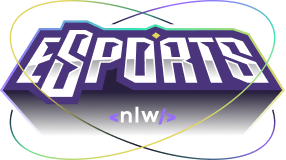
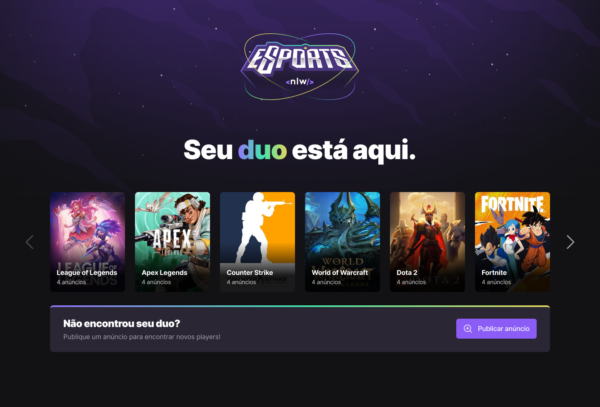

<h1 align="center">
    
</h1>

  <a href="#-tecnologias">Tecnologias</a>&nbsp;&nbsp;&nbsp;|&nbsp;&nbsp;&nbsp;
  <a href="#-projeto">Projeto</a>&nbsp;&nbsp;&nbsp;|&nbsp;&nbsp;&nbsp;
  <a href="#-layout">Layout</a>&nbsp;&nbsp;&nbsp;|&nbsp;&nbsp;&nbsp;
  <a href="#memo-licença">Licença</a>

 

  

## 🚀 Tecnologias
Esse projeto foi desenvolvido com as seguintes tecnologias:

- [Node.js](https://nodejs.org/en/)
- [React](https://reactjs.org)
- [ReactNative](https://reactnative.dev)
- [Expo](https://expo.io/)
- [TypeScript](https://www.typescriptlang.org/)
- [Vite](https://vitejs.dev/)

## 💻 Projeto
Projeto construído do evento Next Level Week da Rocketseat.

## 🔖 Layout
No link abaixo você encontra o layout do projeto web e também do mobile. Lembrando que você precisa ter uma conta no [Figma](http://figma.com/) para acessá-lo.

- [Layout](https://www.figma.com/community/file/1150897317533332617)

## :memo: Licença

Esse projeto está sob a licença MIT. Veja o arquivo [LICENSE](LICENSE.md) para mais detalhes.
